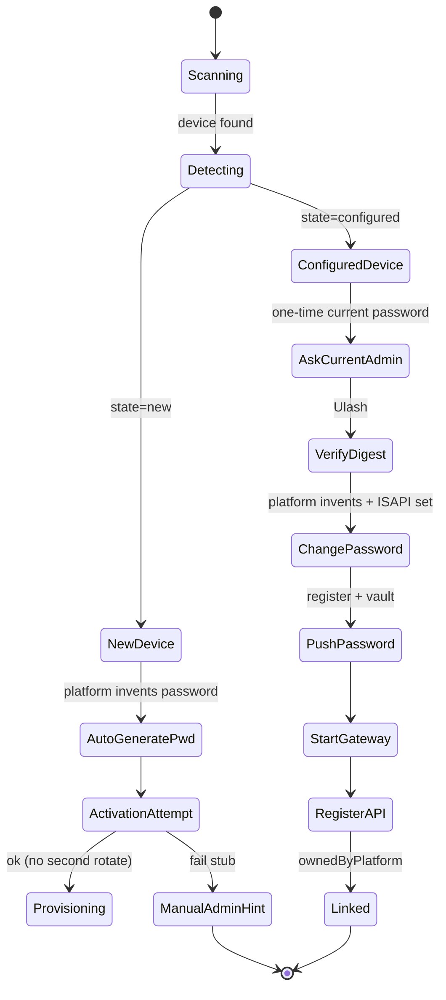

# HR HUB — Qurilma bog‘lash va avto-sozlash: to‘liq mahsulot rejasi

> **Versiya:** 1.2  
> **Sana:** 2026-09-07  
> **Maqsad:** Face ID / Hikvision terminallarini ofis LAN/WiFi orqali platformaga ulash, ikki xil qurilma holatini qo‘llab-quvvatlash, Windows `.exe` orqali operator uchun sodda jarayon, admin parolini xavfsiz saqlash va **boshqaruvni Webga topshirish**.  
> **Auditoriya:** mahsulot, backend, frontend, DevOps, field operator.

---

## Mundarija

1. [Kontekst va mavjud asos](#1-kontekst-va-mavjud-asos)
2. [Maqsad va tamoyillar](#2-maqsad-va-tamoyillar)
3. [Ikki qurilma holati](#3-ikki-qurilma-holati)
4. [Foydalanuvchi oqimi (Windows .exe)](#4-foydalanuvchi-oqimi-windows-exe)
5. [Windows ilova arxitekturasi](#5-windows-ilova-arxitekturasi)
6. [Platforma backend](#6-platforma-backend)
7. [Parol va maxfiylik](#7-parol-va-maxfiylik)
8. [Tarmoq: WiFi va LAN](#8-tarmoq-wifi-va-lan)
9. [Xatoliklar, qayta urinish, bloklash](#9-xatoliklar-qayta-urinish-bloklash)
10. [Web UI o‘zgarishlari](#10-web-ui-o‘zgarishlari)
11. [Fazalar bo‘yicha roadmap](#11-fazalar-boyicha-roadmap)
12. [Senior maslahatlar va risklar](#12-senior-maslahatlar-va-risklar)
13. [Mavjud kod bazasi xaritasi](#13-mavjud-kod-bazasi-xaritasi)
14. [API katalogi (hozir + reja)](#14-api-katalogi-hozir--reja)
15. [Qabul mezonlari (Definition of Done)](#15-qabul-mezonlari-definition-of-done)
16. [Appendix: operator yo‘riqnomasi (qisqa)](#16-appendix-operator-yoriqnomasi-qisqa)

---

## 1. Kontekst va mavjud asos

HR HUB da qurilma integratsiyasi allaqachon mavjud, lekin **field provisioning** hali to‘liq mahsulot darajasida emas.

### Hozirgi arxitektura

```
[Ofis LAN — Hikvision terminal] ←ISAPI→ [device-gw :8800]
                                              ↓
                                    [cloudflared tunnel]
                                              ↓
                              [Nest API — Railway / localhost:3002]
                                              ↓
                                    [PostgreSQL + MinIO]
```

**Asosiy cheklov:** terminal `192.168.x.x` da qoladi; bulut to‘g‘ridan-to‘g‘ri ulanmaydi. Ofis kompyuterida **gateway + tunnel** ishlab turishi kerak.

### Nima allaqachon bor

| Komponent | Joylashuv | Holat |
|-----------|-----------|-------|
| **device-gw** | `apps/device-gw` | Hikvision ISAPI production-ready |
| **office-link GUI** | `tools/office-link` | Tkinter, LAN scan, parol, tunnel |
| **HRHUB-Qurilma.exe** | `tools/office-link/BUILD-EXE.bat` | PyInstaller build |
| **office-link API** | `apps/api/.../office-link.controller.ts` | `ping`, `announce`, `device` |
| **Parol o‘zgartirish** | GW + API `change-password`, `sync-password` | Ishlaydi |
| **Admin login lock** | GW punch lock + heartbeat | Ishlaydi |
| **Web: Устройства** | `catalog/devices` | CRUD, lokatsiya talab qilinadi |
| **Web: Удалённое управление** | `catalog/device-control` | Remote buyruqlar |

### Asosiy bo‘shliqlar (gaps)

| Bo‘shliq | Ta’sir | Holat (2026-09-07) |
|----------|--------|---------------------|
| Yangi vs admin bor **avtomatik aniqlash** yo‘q | Operator noto‘g‘ri parol turini kiritadi | ✅ `detect_state` + GUI yorliqlar |
| **Factory / birinchi aktivatsiya** skripti yo‘q | Yangi qurilma qo‘lda yoqiladi | 🟡 best-effort probe; to‘liq RSA = Faza 3 |
| office-link **lokatsiyasiz** qurilma yaratadi | Face sync ishlamaydi | ✅ `locationId` majburiy |
| **Tunnel vaqtinchalik** (`trycloudflare.com`) | Har restartda URL o‘zgaradi | ✅ named token + trycloudflare fallback |
| Parol DB da **shifrlanmagan** (`passwordEnc`) | Xavfsizlik / audit riski | ✅ AES-GCM vault dual-write + redact |
| GW **xotirada** — restartdan keyin qayta register | Barqarorlik past | 🟡 bootstrap retry; to‘liq Redis registry = 2.4 |
| GUI yopilsa **tunnel to‘xtaydi** | Platforma ulanishi uziladi | ✅ Service + `service.json` handoff |
| ZKTeco adapter **stub** | Faqat Hikvision to‘liq | ⏳ Faza 3 |
| Platformadan **.exe yuklab olish** yo‘q | Qo‘lda USB/AnyDesk nusxa | 🟡 `release/` + ZIP; production URL = env |
| Real-time **provisioning progress** yo‘q | Admin nima bo‘layotganini ko‘rmaydi | ✅ session progress + Web poll 2s |
| Operator **eski parolni saqlab** qoladi | Guvohlar qayta sozlay oladi | ✅ platforma parol o‘ylab o‘rnatadi + vault; GUI da ko‘rsatilmaydi |

---

## 2. Maqsad va tamoyillar

### Mahsulot maqsadi

Ofis xodimi (operator) platformadan **HR HUB Link** dasturini yuklab oladi, yo‘riqnoma va shartlarni o‘qiydi, **«Avto-sozlash»** tugmasini bosadi — qolgan ishlar (terminal ISAPI, parol, gateway, tunnel, platforma registratsiyasi) fonida bajariladi. Admin platformada qurilma holatini va parolni (faqat admin huquqi bilan) ko‘radi.

### Dizayn tamoyillari

| # | Tamoyil | Izoh |
|---|---------|------|
| 1 | **Operator oddiy** | 1–2 tugma, minimal texnik matn |
| 2 | **Admin maxfiy** | Qurilma paroli faqat `tenant_admin` / `platform_admin` |
| 3 | **Ikki holat aniq** | Tizim avtomatik: **Yangi** yoki **Admin o‘rnatilgan** |
| 4 | **Xavfsizlik birinchi** | Xato → aniq xabar, qayta so‘rash, bloklash |
| 5 | **Platforma real-time** | Har bosqich: `scanning` → `configuring` → `linked` |
| 6 | **Fon ishlar yashirin** | ISAPI, GW, tunnel — progress bar orqali |
| 7 | **Idempotent** | Qayta ishga tushirish xavfsiz (serial bo‘yicha upsert) |
| 8 | **Audit** | Kim parol ko‘rdi / o‘zgartirdi — jurnal |

---

## 3. Ikki qurilma holati

### 3.1 Holatlar ta’rifi

#### A) **YANGI** (`provision_state: new`)

- Qurilma yoqilgan, lekin **admin paroli hali platforma siyosatiga mos emas** yoki Hikvision **aktivatsiya** talab qiladi.
- Operator **parol kiritmaydi** (GUI maydon o‘chirilgan) — tizim o‘zi o‘ylab topadi.
- Skript bajaradi (hozirgi amaliyot):
  1. `generate_terminal_password` (Hikvision qoidalari)
  2. Best-effort factory aktivatsiya (`attempt_factory_activation`)
  3. Muvaffaqiyat → `provision_configured(..., rotate_password=False)` → GW + tunnel + register + vault
  4. Muvaffaqiyatsiz → aniq stub: avval terminalda admin o‘rnating, keyin «Admin bor»
- To‘liq RSA / barcha model aktivatsiya = **Faza 3**

#### B) **FAOL / ADMIN BOR** (`provision_state: configured`)

- Terminalda **admin paroli allaqachon o‘rnatilgan**.
- Operator **faqat HOZIRGI** parolni **bir marta** yozadi (yashirin maydon).
- Skript bajaradi (**majburiy parol rotatsiyasi** — 2026-09-07):
  1. Digest auth tekshiruvi (joriy parol)
  2. Platforma **yangi** parol o‘ylab topadi (`passwords.generate_terminal_password`)
  3. ISAPI `PUT /Security/users/{id}` + `loginPassword` — qurilmaga o‘rnatish
  4. Yangi parolni tekshirish → gateway + tunnel
  5. `office-link/device` register → vault dual-write; `meta.auth.ownedByPlatform = true`
  6. Yangi parol GUI da **ko‘rsatilmaydi**; sessiyadan tozalanadi
  7. Keyingi sozlash / parol — **faqat Web** (tenant admin); guvohlar qayta sozlamasin
- Yuz / barmoq wipe — hali ixtiyoriy tenant siyosati (Faza 2+/3)
### 3.2 Holat aniqlash algoritmi

```
LAN/WiFi scan
      ↓
GET /ISAPI/System/deviceInfo (yoki probe)
      ↓
┌─────────────────────────────────────────┐
│ 401 + activation / deviceLocked?        │ → NEW
│ 401 + default creds fail?               │ → NEW
│ deviceActivated == false (model meta)?  │ → NEW
│ Digest admin + parol → 200?           │ → CONFIGURED
│ DB: status in (new, registered)       │ → NEW (platforma)
│       && isActive == false              │
└─────────────────────────────────────────┘
```

| Signal | Yangi | Admin bor |
|--------|:-----:|:---------:|
| `401` + activation header | ✓ | |
| Barcha default parollar rad | ✓ | |
| `deviceActivated=false` | ✓ | |
| Digest `admin` + parol → `200` | | ✓ |
| Platformada `filter=new` | ✓ | |

### 3.3 Holat diagrammasi



---

## 4. Foydalanuvchi oqimi (Windows .exe)

### 4.1 Rollar

| Rol | Kim | Nima qiladi |
|-----|-----|-------------|
| **Cloud admin** | IT / tenant admin | Pairing token yaratadi, `.exe` yuklaydi, lokatsiya tayinlaydi |
| **Field operator** | Ofis xodimi | Token + lokatsiya; «Admin bor» da faqat **joriy** parol bir marta; yangi parolni ko‘rmaydi |
| **Tizim** | HR HUB Link + GW | Parol generatsiya/o‘rnatish, vault, tunnel, register |

> **Muhim:** `DEVICE_LINK_KEY` / `link.key` operatorga ko‘rinmasin. Birinchi marta admin Railway/env ga yozadi yoki **vaqtinchalik pairing token** (web) ishlatiladi.

### 4.2 O‘rnatish (platformadan)

1. Web: **Настройки → Устройства → Скачать HR HUB Link**
2. Fayl: `HRHUB-Link-Setup-x.y.z.exe` (yoki portable `HRHUB-Qurilma.exe`)
3. Installer tarkibi:
   - GUI (WPF yoki Tkinter — Faza 1: mavjud Tkinter kengaytma)
   - Embedded `device-gw`
   - `cloudflared.exe`
   - Konfig shablon (`apiUrl`, `tenantCode`)

### 4.3 Wizard bosqichlari

| # | Ekran | Foydalanuvchi harakati | Fon |
|---|--------|------------------------|-----|
| 0 | Til / kirish | — | — |
| 1 | **Shartlar va maxfiylik** | Checkbox «O‘qidim va qabul qilaman» | — |
| 2 | **Pairing** | QR skan yoki token paste (admin bergan) | API token tekshiruv |
| 3 | **Tarmoq** | «Tekshirish» | WiFi/LAN/Internet probe |
| 4 | **Qurilma qidiruv** | Kutish | Subnet scan + Hikvision probe |
| 5 | **Tanlash** | Ro‘yxatdan IP/model/serial | — |
| 6 | **Holat** | Avtomatik | `detect_state` |
| 7 | **Parol** | «Admin bor»: hozirgi parol bir marta; «Yangi»: maydon o‘chirilgan | Platforma yangi parol o‘ylab o‘rnatadi |
| 8 | **Avto-sozlash** | Progress | verify → change_password → GW → tunnel → register/vault |
| 9 | **Tayyor** | Service o‘rnatish eslatmasi; «Yopish» | Handoff `service.json`; boshqaruv Webda |

### 4.4 Modal oyna talablari (UX)

- Markazda, modal, boshqa UI bloklangan
- Parol maydoni `type=password`, ko‘rsatish tugmasi ixtiyoriy
- **1 xato** → qizil xabar + qayta kiritish
- **2 xato** → 30 daqiqa blok (mavjud `auth_lock.py` uslubi)
- Hikvision parol qoidalari pastda kichik matn (8–16, 2 tur belgi, username ichida bo‘lmasin)

### 4.5 Platformada real-time monitoring (admin)

Web (faqat admin): **«Ulash sessiyasi»** paneli

```
Sessiya: office-pc-7f3a
Holat: configuring (73%)
Qadam: change_password
Qurilma: 192.168.1.50 · DS-K1T671 · SN12345
```

Transport: WebSocket yoki SSE; fallback — polling 2s.

---

## 5. Windows ilova arxitekturasi

### 5.1 Komponentlar

```
┌──────────────────────────────────────────────┐
│  HR HUB Link.exe (GUI)                       │
│  - Wizard, modal, progress, auth_lock        │
│  - platforma: session progress POST          │
└──────────────────┬───────────────────────────┘
                   │
┌──────────────────▼───────────────────────────┐
│  ProvisionEngine (Python modul)              │
│  detect_state()                              │
│  activate_new()                              │
│  verify_admin()                              │
│  wipe_credentials()  # face/fp optional      │
│  set_password()                              │
│  push_password_to_platform()                 │
│  start_gateway_and_tunnel()                  │
│  register_device()                           │
└──────────────────┬───────────────────────────┘
         ┌─────────┴─────────┐
         ▼                   ▼
  device-gw:8800      cloudflared
         │                   │
         └─────────┬─────────┘
                   ▼
            Nest API (/office-link/*)
```

### 5.2 Mavjud fayllar (kengaytirish nuqtalari)

| Fayl | Vazifa | Holat |
|------|--------|-------|
| `tools/office-link/office_link_gui.py` | GUI | ✅ pairing + lokatsiya + bir marta parol + handoff matn |
| `tools/office-link/session.py` | Session | ✅ `provision_new` / `provision_configured` |
| `tools/office-link/provision.py` | ProvisionEngine | ✅ detect + activate + **rotate password** |
| `tools/office-link/passwords.py` | Parol | ✅ generate + ISAPI change + policy |
| `tools/office-link/discovery.py` | LAN scan | ✅ |
| `tools/office-link/auth_lock.py` | Bloklash | ✅ 2-strike |
| `tools/office-link/runtime_setup.py` | GW+tunnel | ✅ + Service Faza 2 |
| `tools/office-link/service_worker.py` | Headless | ✅ |
| `tools/office-link/api_client.py` | API | ✅ |
| `tools/office-link/BUILD-EXE.bat` | Build | ✅ |
| `tools/office-link/pack-release.bat` | Ofis paketi | ✅ `release/HRHUB-Link/` + ZIP |
| `tools/office-link/QOLLAMA.txt` | Yo‘riqnoma | ✅ |

### 5.3 Build va tarqatish

- **Faza 1:** PyInstaller `onedir` (`HRHUB-Qurilma.spec` → `dist/HRHUB-Qurilma/`)
- **Ofis paketi:** `pack-release.bat` → `release/HRHUB-Link/` (`ilova\*.exe`, `.bat`, `buyruqlar\`, `QOLLAMA.txt`) + `HRHUB-Link-portable.zip`
- **Faza 2 lite:** `pack-installer.bat` (ZIP) + `INSTALL.iss` (Inno Setup)
- **Faza 3:** Code signing (SmartScreen)
- Platforma: `OFFICE_LINK_DOWNLOAD_URL` / `GET download` — production hosting (⏳)
### 5.4 Windows Service (Faza 2)

GW + tunnel **NSSM** / **sc.exe** / Task Scheduler orqali:

- `tools/office-link/service_worker.py` — headless supervisor
- `install-service.bat` / `uninstall-service.bat` (UZ xabarlar)
- GUI «Ulash» → `data/service.json` handoff; holat: `data/service_status.json`
- Named tunnel: `cloudflareTunnelToken` + `namedTunnelUrl` (trycloudflare fallback)
- Yo‘riqnoma: `SERVICE.txt`

---

## 6. Platforma backend

### 6.1 Yangi API endpointlar (reja)

| Method | Endpoint | Auth | Vazifa |
|--------|----------|------|--------|
| POST | `/office-link/pairing-token` | JWT admin | 15 daqiqalik token + QR payload |
| POST | `/office-link/session` | Pairing token | Sessiya `id` yaratish |
| PATCH | `/office-link/session/:id/progress` | Pairing token | `step`, `percent`, `message` |
| POST | `/office-link/device/detect` | Pairing token | `{ state: new\|configured, meta }` |
| POST | `/office-link/device/provision` | Pairing token | To‘liq pipeline trigger |
| POST | `/office-link/device/password` | Pairing token | Parolni vault ga yozish |
| GET | `/office-link/download` | JWT admin | `.exe` redirect |
| GET | `/office-link/sessions` | JWT admin | Faol/yakunlangan sessiyalar |
| WS | `/office-link/session/:id/stream` | JWT admin | Real-time progress |

### 6.2 Mavjud API (o‘zgartirmasdan ishlatiladi)

| Method | Endpoint | Izoh |
|--------|----------|------|
| GET | `/office-link/ping?tenantCode=` | Internet + tenant |
| POST | `/office-link/announce` | Tunnel URL → tenant settings |
| POST | `/office-link/device` | Upsert by host/serial |
| POST | `/attendance/devices/:id/change-password` | Web admin parol o‘zgartirish |
| POST | `/attendance/devices/:id/sync-password` | Terminal parolini DB ga yozish |

### 6.3 `provision` pipeline (server yoki client)

**Tavsiya:** asosiy ISAPI ishlar **client (GW)** da, platforma **audit + vault + DB** da.

Ketma-ketlik:

1. `detect` → holat
2. `verify` yoki `activate`
3. `wipe` (optional, tenant policy)
4. `change-password` → GW `POST /devices/{id}/change-password`
5. `POST /office-link/device/password` → vault
6. `announce` tunnel
7. `POST /office-link/device` (+ `locationId`)
8. `heartbeat` ingest
9. `session` → `linked`

### 6.4 Ma’lumotlar modeli (reja)

```prisma
// Reja — hozirgi schema ga qo‘shimcha

model DeviceProvisionSession {
  id          String   @id @default(uuid())
  tenantId    String
  createdById String?
  status      String   // scanning | configuring | linked | failed
  step        String?
  percent     Int      @default(0)
  host        String?
  serial      String?
  deviceId    String?
  meta        Json?
  createdAt   DateTime @default(now())
  updatedAt   DateTime @updatedAt
}

model DeviceCredentialVault {
  deviceId    String   @id
  tenantId    String
  ciphertext  String   // AES-256-GCM
  keyVersion  Int
  updatedById String?
  updatedAt   DateTime @updatedAt
}

model DeviceCredentialAudit {
  id        String   @id @default(uuid())
  tenantId  String
  deviceId  String
  userId    String?
  action    String   // view | change | sync | vault_write
  ip        String?
  createdAt DateTime @default(now())
}
```

### 6.5 office-link device + lokatsiya

✅ **Tuzatilgan:** `locationId` create da majburiy; GUI lokatsiya dropdown (`GET .../office-link/locations`).

Register (`POST .../office-link/device`) dan keyin:

- `persistDevicePassword` + AES vault dual-write
- `meta.auth.ownedByPlatform = true`
- `meta.auth.passwordRotatedOnProvision = true`
- `meta.auth.provisionedAt` ISO timestamp
- Audit: `vault_write`

---

## 7. Parol va maxfiylik

### 7.1 Hozirgi holat (2026-09-07)

| Band | Holat |
|------|-------|
| AES-GCM vault (`DeviceCredentialVault`) | ✅ |
| Dual-write `passwordEnc` + vault | ✅ |
| List/get redact (admin ko‘radi) | ✅ |
| Audit `view` / `change` / `sync` / `vault_write` | ✅ |
| Provision: platforma parol o‘ylab + ISAPI o‘rnatish | ✅ `passwords.py` |
| Yangi parol GUI da yashirin | ✅ |
| `ownedByPlatform` meta | ✅ |
| Operator faqat joriy parol (bir marta) | ✅ |
| Face wipe on provision | ⏳ tenant flag |

### 7.2 Maqsad arxitektura

| Qatlam | Yechim |
|--------|--------|
| Transport | HTTPS + pairing token (qisqa muddat) |
| Saqlash | AES-256-GCM (`DEVICE_CREDENTIAL_VAULT_KEY` / link key) |
| Ko‘rsatish | Faqat `tenant_admin` / `platform_admin` + audit |
| GW ga uzatish | API decrypt faqat server-side; GW ga vaqtinchalik |
| Log | Parol hech qachon logga yozilmasin |
| Field | Guvohlar qayta sozlamasin — boshqaruv Webda |

### 7.3 Parol o‘zgarishida platformaga xabar

**Asosiy yo‘l (hozir):** `POST /office-link/device` body da yangi parol → `officeLinkDevice` vault + meta.

**Qo‘shimcha endpoint:** `POST /office-link/device/password` (pairing) — mavjud qurilma uchun vault yangilash.

API natija:

1. Vault ga shifrlab yozadi
2. `devices.passwordEnc` dual-write
3. `meta.auth.passwordOutOfSync = false`, `ownedByPlatform = true`
4. Audit: `vault_write` / provision

### 7.4 RBAC

| Rol | Parol ko‘rish | Provision boshlash |
|-----|:--------------:|:------------------:|
| `platform_admin` | ✓ | ✓ |
| `tenant_admin` | ✓ | ✓ |
| `hr_manager` | ✗ | ✗ |
| `employee` | ✗ | ✗ |

---

## 8. Tarmoq: WiFi va LAN

### 8.1 Tekshiruvlar

| Tekshiruv | Usul | Muvaffaqiyat |
|-----------|------|--------------|
| **Internet** | `GET /office-link/ping` | 200 |
| **LAN** | Subnet scan + ISAPI probe | ≥1 device |
| **PC ↔ terminal** | TCP :80/:443 + Digest | 200 |
| **GW ↔ terminal** | `verify-password` | ok |
| **API ↔ GW** | `announce` + `heartbeat` | ok |

### 8.2 WiFi vs LAN kabel

- **LAN kabel:** klassik — PC va terminal bir switchda
- **WiFi:** terminal WiFi da, PC ham shu subnetda bo‘lishi kerak
- Ilova **ikkala NIC** ni ko‘rsatadi; scan barcha aktiv interfeyslar bo‘yicha
- Terminal WiFi sozlash (Faza 3): brauzer orqali `http://<device-ip>` yoki ISAPI `Wireless` (modelga bog‘liq)

### 8.3 Xabarlar

| Holat | Xabar |
|-------|-------|
| Terminal topilmadi | «Qurilma va kompyuter bir tarmoqda ekanligini tekshiring» |
| Faqat WiFi, PC boshqa subnet | «WiFi IP: … — PC subnet: … mos emas» |
| Firewall | «Windows Firewall 8800/ tunnel ga ruxsat bering» |

---

## 9. Xatoliklar, qayta urinish, bloklash

### 9.1 Xato kodlari

| Kod | Foydalanuvchi xabari (UZ) | Texnik sabab |
|-----|---------------------------|--------------|
| `AUTH_WRONG` | Parol noto‘g‘ri. Qayta kiriting. | Digest 401 |
| `AUTH_LOCKED` | 2 marta xato. 30 daqiqa kuting. | `auth_lock` |
| `DEVICE_OFFLINE` | Qurilma javob bermayapti. IP ni tekshiring. | Timeout |
| `PWD_RULE` | Parol qoidalarga mos emas (8–16, 2 tur). | Hikvision rule |
| `ACTIVATION_FAIL` | Aktivatsiya amalga oshmadi. | ISAPI |
| `TUNNEL_FAIL` | Internet ulanishi xato. Qayta uriniladi… | cloudflared |
| `API_REJECT` | Ulanish kaliti eskirgan. Admindan yangisini oling. | 401 token |
| `GW_DOWN` | Gateway ishga tushmadi. | Port 8800 |
| `LOCATION_REQUIRED` | Lokatsiya tanlanmagan. | Validation |

### 9.2 Qayta urinish siyosati

| Operatsiya | Max urinish | Backoff |
|------------|:-----------:|---------|
| LAN scan | 3 | 5s |
| Digest auth | 2 (keyin lock) | — |
| Tunnel start | 3 | 10s |
| API register | 5 | 2s exponential |
| change-password | 2 | 5s |

### 9.3 Bloklash qatlamlari

1. **GUI `auth_lock`:** 2 xato → 30 min (mavjud)
2. **Platforma rate limit:** IP + token, 10 req/min `/office-link/*`
3. **Hikvision terminal:** admin login lock → GW `punchLock` (mavjud)
4. **Sessiya limit:** 5 parol urinishi / sessiya

Har blokda **qolgan vaqt** UI da ko‘rsatiladi.

---

## 10. Web UI o‘zgarishlari

### 10.1 Yangi / o‘zgartirilgan sahifalar

| Sahifa | O‘zgarish |
|--------|-----------|
| **Настройки → Устройства → Связь** | Pairing token, QR, `.exe` yuklab olish, sessiyalar |
| **Устройства** | «Ulash vositasi» CTA, provisioning holati |
| **Новые устройства** | `filter=new` + lokatsiya tayinlash |
| **Устройства → карточка** | Parol (admin), `passwordOutOfSync`, provision tarixi |
| **Удалённое управление** | Online/offline + tunnel holati |

### 10.2 Pairing token UI

- Tugma: «Yangi ulash sessiyasi»
- QR (15 min TTL)
- Token nusxalash
- Faol sessiyalar jadvali

### 10.3 Download sahifasi

- Versiya, changelog
- Tizim talablari: Windows 10+, .NET optional, 200MB disk
- SHA256 checksum

---

## 11. Fazalar bo‘yicha roadmap

### Faza 1 — MVP ✅ (asosiy)

**Maqsad:** Operator bitta terminalni ikki holat bilan ulay oladi; parol platformada admin uchun saqlanadi; **boshqaruv Webga topshiriladi**.

| # | Task | Holat |
|---|------|-------|
| 1.1 | `detect_state` (office-link) | ✅ |
| 1.2 | GUI: pairing + lokatsiya + bir marta parol | ✅ |
| 1.3 | `ProvisionEngine`: new + configured + **password rotate** | ✅ |
| 1.4 | API: session/progress, device/password, dual-auth | ✅ |
| 1.5 | Device credential vault (AES) | ✅ |
| 1.6 | office-link: `locationId` majburiy | ✅ |
| 1.7 | Web: `/catalog/devices/link` pairing UI | ✅ |
| 1.8 | Web: sessiya monitoring (poll 2s) | ✅ |
| 1.9 | BUILD-EXE + `pack-release` ofis paketi | ✅ |
| 1.10 | E2E smoke: unit tests | ✅; real terminal lab ⏳ |

### Faza 2 — Barqarorlik

| # | Task | Holat |
|---|------|-------|
| 2.1 | Windows Service (GW + tunnel) | ✅ `service_worker.py` + install/uninstall + `SERVICE.txt` |
| 2.2 | Named Cloudflare tunnel | ✅ token + `tunnel_url.txt`; trycloudflare fallback |
| 2.3 | Audit log (parol ko‘rish/o‘zgartirish) | ✅ `DeviceCredentialAudit` + Web credential-audits |
| 2.4 | GW persistent registry (Redis yoki API re-bootstrap) | 🟡 bootstrap retry; to‘liq Redis ⏳ |
| 2.5 | Bulk provision (3–5 terminal) | ✅ lite: `bulk_provision.py` (max 5) |
| 2.6 | MSI / ofis tarqatish | ✅ `pack-release.bat` + ZIP + `INSTALL.iss` |
| 2.7 | Platforma parol rotatsiyasi (handoff Web) | ✅ `passwords.py` + vault + `ownedByPlatform` |

### Faza 3 — Kengaytma (qisman / ochiq)

| # | Task | Holat |
|---|------|-------|
| 3.1 | Hikvision to‘liq factory activation (RSA / barcha model) | 🟡 best-effort probe; to‘liq ⏳ |
| 3.2 | Terminal WiFi / NTP / HTTPS wizard | ⏳ |
| 3.3 | ZKTeco real adapter + provision | ⏳ |
| 3.4 | Code signing + auto-update channel | ⏳ |
| 3.5 | Offline queue (internet keyin sync) | ⏳ |
| 3.6 | Face/fp wipe on provision (tenant flag) | ⏳ |
| 3.7 | `OFFICE_LINK_DOWNLOAD_URL` production hosting | ⏳ |
---

## 12. Senior maslahatlar va risklar

### 12.1 Kritik risklar

| Risk | Ehtimollik | Ta’sir | Mitigatsiya |
|------|:----------:|:------:|-------------|
| Tunnel URL o‘zgarishi | O‘rta | Yuqori | ✅ Named tunnel / Service; trycloudflare fallback |
| Parol plaintext DB | Past | Yuqori | ✅ Vault + dual-write + redact |
| GUI yopilsa punch to‘xtaydi | Past | O‘rta | ✅ Windows Service Faza 2 |
| Operator / guvoh eski parolni biladi | Past | O‘rta | ✅ Provision da rotatsiya; yangi parol GUI da yo‘q |
| Model farqi (Hikvision) | O‘rta | O‘rta | Model whitelist + qo‘lda fallback |
| Yuz wipe qaytarilmas | Past | Yuqori | Aniq UI ogohlantirish + policy flag |

### 12.2 Mahsulot qarorlari (tavsiyalar)

1. **Tunnel** — production uchun `trycloudflare.com` yetarli emas; named tunnel yoki ofis reverse proxy rejalashtiring.

2. **Parol** — ✅ vault + dual-write; provision da platforma o‘zi yangi parol o‘rnatadi. KMS / tenant DEK — keyingi qadam.

3. **Eski admin tozalash** — default: faqat **parol almashtirish**; yuz/barmoq wipe — tenant sozlamasi (`wipeFacesOnProvision: boolean`).

4. **Ikki provisioning yo‘li** — web qo‘lda va office-link bir xil validatsiyadan o‘tsin (lokatsiya, adapter).

5. **Rollar** — `link.key` faqat admin; operator faqat pairing token (15 min).

6. **Test lab** — CI da `mock` adapter smoke; haftalik 1 real terminal regression.

7. **Mavjud `office-link` ni qayta yozmang** — `session.py` + GUI ni kengaytiring; tezroq va xavfsizroq.

8. **Offline** — internet bo‘lmasa LAN da provision, keyin «Sinxronlash» (Faza 3).

9. **Hikvision parol qoidalari** — ✅ `passwords.generate_terminal_password` + Nest `generateTerminalPassword`; operator yangi parol kiritmaydi.

10. **Platforma status** — `registered` vs `online` ajratilsin: register bo‘lishi mumkin, tunnel yo‘q bo‘lsa `offline`.

### 12.3 Mos kelmaydigan kutishlar (scope tashqarisi)

- Terminalni **internet orqali to‘g‘ridan-to‘g‘ri** platformaga ulash (arxivitektura qarshi)
- Barcha Hikvision modellarda **bir xil** aktivatsiya API (model dokumentatsiyasi kerak)
- ZKTeco to‘liq qo‘llab-quvvatlash Faza 1 da emas

---

## 13. Mavjud kod bazasi xaritasi

### 13.1 device-gw (Python)

| Fayl | Vazifa |
|------|--------|
| `apps/device-gw/main.py` | FastAPI, register, sync-face, password, remote, poll |
| `apps/device-gw/adapters/hikvision_isapi.py` | ISAPI to‘liq |
| `apps/device-gw/adapters/zkteco_push.py` | Stub |
| `apps/device-gw/adapters/mock.py` | Dev/E2E |

### 13.2 Nest API

| Fayl | Vazifa |
|------|--------|
| `apps/api/src/device-gw/device-gw.client.ts` | GW HTTP client |
| `apps/api/src/attendance/attendance.service.ts` | Device CRUD, sync, password |
| `apps/api/src/attendance/office-link.controller.ts` | Field linking (ping/announce/device) |
| `apps/api/src/attendance/office-link-provision.controller.ts` | Pairing session/progress/password |
| `apps/api/src/attendance/office-link-auth.guard.ts` | Link key **yoki** pairing |
| `apps/api/src/attendance/device-credential-vault.service.ts` | AES-GCM vault |
| `apps/api/src/attendance/device-credential-audit.service.ts` | Parol audit |
| `apps/api/src/attendance/device-link.guard.ts` | `DEVICE_LINK_KEY` |
| `apps/api/src/attendance/device-sync-bootstrap.service.ts` | GW restart bootstrap + retry |

### 13.3 Web

| Fayl | Vazifa |
|------|--------|
| `apps/web/.../catalog/devices/*` | Katalog, forma, parol UI |
| `apps/web/.../catalog/devices/link/*` | Pairing token + sessiya poll |
| `apps/web/.../catalog/device-control/*` | Remote boshqaruv |

### 13.4 Windows tool

| Fayl | Vazifa |
|------|--------|
| `tools/office-link/office_link_gui.py` | Operator GUI |
| `tools/office-link/session.py` | Scan + provision orchestratsiya |
| `tools/office-link/provision.py` | detect_state + ProvisionEngine |
| `tools/office-link/passwords.py` | Generate + ISAPI change password |
| `tools/office-link/discovery.py` | LAN |
| `tools/office-link/auth_lock.py` | 2-strike lock |
| `tools/office-link/service_worker.py` | Windows Service supervisor |
| `tools/office-link/pack-release.bat` | `release/HRHUB-Link/` ofis paketi |
| `tools/office-link/QOLLAMA.txt` | Operator yo‘riqnoma (UZ) |
| `tools/office-link/SERVICE.txt` | Service yo‘riqnoma |
---

## 14. API katalogi (hozir + reja)

### Hozir ishlaydi

**Office-link (public, `X-Device-Link-Key`):**

- `GET /api/office-link/ping?tenantCode=`
- `POST /api/office-link/announce` — `{ gwUrl }`
- `POST /api/office-link/device` — host, serial, password, …

**Attendance devices (JWT):**

- `GET/POST/PATCH/DELETE /api/attendance/devices`
- `POST /api/attendance/devices/:id/change-password`
- `POST /api/attendance/devices/:id/sync-password`
- `GET /api/attendance/devices/:id/credential-audits` — tenant_admin / platform_admin
- `POST /api/attendance/devices/:id/remote` — heartbeat, sync, sync_clock, pull_events, open_door, reboot

**Ingest (public, `X-Punch-Key`):**

- `POST /api/attendance/punches/ingest`
- `POST /api/attendance/heartbeats/ingest`

**device-gw (local :8800):**

- `POST /devices/{id}/change-password`
- `POST /devices/{id}/verify-password`
- `POST /devices/{id}/sync-face`
- `POST /devices/{id}/remote`

### Rejada qo‘shiladi

Barcha yangi endpointlar [§6.1](#61-yangi-api-endpointlar-reja) da.

---

## 15. Qabul mezonlari (Definition of Done)

### Faza 1 MVP — bajarilgan deb hisoblash

- [x] Operator platformadan pairing/download sahifasini ochadi (`/catalog/devices/link`); `.exe` → `release/HRHUB-Link/` yoki `BUILD-EXE.bat`
- [x] Tizim **yangi** va **admin bor** holatini aniqlaydi (`detect_state` + GUI yorliqlar)
- [x] Yangi: platforma parol o‘ylab aktivatsiya (best-effort); fail → aniq stub (Faza 3 to‘liq RSA)
- [x] Admin bor: joriy parol bir marta → **yangi parol o‘ylab ISAPI o‘rnatish** → register + lokatsiya → vault
- [x] Yangi parol GUI da **ko‘rsatilmaydi**; `meta.auth.ownedByPlatform`; guvohlar qayta sozlamasin
- [x] Parol vault (AES-GCM) + list/get redact (admin ko‘radi) + audit
- [x] Qurilma `office-link/device` + **lokatsiya** (`locationId` majburiy create)
- [x] Pairing token GUI + Nest dual-auth: `X-Pairing-Token` **YOKI** `X-Device-Link-Key`
- [x] Progress PATCH; DTO `tenantCode` whitelist OK
- [x] Session bind → ixtiyoriy `linkKey`
- [x] Web da sessiya progress (2s polling)
- [x] 2 xato parol → 30 min blok
- [x] LAN scan + internet ping
- [x] `QOLLAMA.txt` — Admin 5 + Operator 7 + parol handoff (UZ)
- [x] Smoke: office-link unit tests (passwords/provision/session)
- [ ] E2E 1 real Hikvision terminal lab
- [ ] `OFFICE_LINK_DOWNLOAD_URL` production hosting
- [x] Faza 2: Windows Service + named tunnel + bulk CLI + ZIP/Inno + audit + bootstrap retry + **password rotate handoff**
- [x] Faza 3 (best-effort): factory activation probe + stub fallback
- [ ] Faza 3 to‘liq: RSA aktivatsiya barcha modellarda, ZKTeco, code signing, offline queue, face wipe policy

---

## 16. Appendix: operator yo‘riqnomasi (qisqa)

To‘liq oddiy matn: `tools/office-link/QOLLAMA.txt`

### Admin (5 qadam)

1. Web: **Устройства → Связь с офисом** → «Создать токен» → nusxa
2. Ofisga `release/HRHUB-Link/` yoki ZIP / `BUILD-EXE.bat`
3. Env: `DEVICE_LINK_KEY` ≈ `PUNCH_INGEST_API_KEY`
4. Tokenni ofis operatoriga bering (~15 daqiqa)
5. Sessiyalar jadvalida progressni kuzating

### Ofis operatori (7 qadam)

1. PC + terminal bir tarmoqda
2. `BOSHLASH.bat` / `HRHUB-Qurilma.exe`
3. Pairing token → Saqlash
4. Lokatsiya tanlang
5. Qurilma / IP → Qidirish
6. «Admin bor» → **hozirgi** parol bir marta → Ulash (tizim yangi parol o‘rnatadi)
7. «Ulandi» → `install-service.bat` (ADMIN); keyin oynani yopish mumkin

### Muhim eslatmalar

- Qurilma **ochiq internet IP** orqali ulanmaydi
- Yangi parol operator/guvohga **ko‘rsatilmaydi** — boshqaruv Webda
- Ulashdan keyin guvohlar qurilmani **qayta sozlamasin**
- «Yangi»: avto-parol aktivatsiya best-effort; fail bo‘lsa terminalda admin, keyin «Admin bor»
- 2 marta noto‘g‘ri parol → 30 daqiqa kutish
- Timeout ≠ parol xatosi

---

## Bog‘liq hujjatlar

- [DEVICES_SIMPLE.md](./DEVICES_SIMPLE.md) — Railway linking qisqa qo‘llanma
- [RAILWAY.md](./RAILWAY.md) — device-gw + tunnel arxitektura
- [DEPLOY.md](./DEPLOY.md) — production deploy
- `tools/office-link/QOLLAMA.txt` — operator yo‘riqnoma (o‘zbekcha)

---

## O‘zgarishlar tarixi

| Sana | Izoh |
|------|------|
| 2026-09-07 | **v1.2 — Platforma parol handoff:** `passwords.py` (generate + ISAPI change); «Admin bor» da joriy parol bir marta → yangi parol o‘rnatish → vault + `ownedByPlatform`; «Yangi» da avto-parol aktivatsiya; GUI/QOLLAMA; `pack-release` / `release/HRHUB-Link/`; unit testlar; reja roadmap/DoD yangilandi. |
| 2026-09-06 | **Faza 2 (office-link):** `service_worker.py` + install/uninstall bat; named tunnel; bulk CLI; pack-installer/Inno; audit + bootstrap retry. |
| 2026-09-06 | **Faza 1 harden:** DTO `tenantCode`; «Yangi» stub; QOLLAMA 5+7; DoD. |
| 2026-09-06 | **Faza 1 E2E wiring:** pairing dual-auth; progress; vault dual-write. |
| 2026-09-06 | **Faza 1 MVP (qisman):** Nest pairing/session/vault/`locationId`; detect + ProvisionEngine; web `/devices/link`. |
| 2026-09-02 | Reja 1.0 |

| Versiya | Sana | Izoh |
|---------|------|------|
| 1.2 | 2026-09-07 | Parol rotatsiyasi + Web handoff; ofis release paketi; reja holatlari yangilandi |
| 1.1 | 2026-09-06 | Faza 1–2 amaliyot + DoD |
| 1.0 | 2026-09-02 | Dastlabki to‘liq reja |