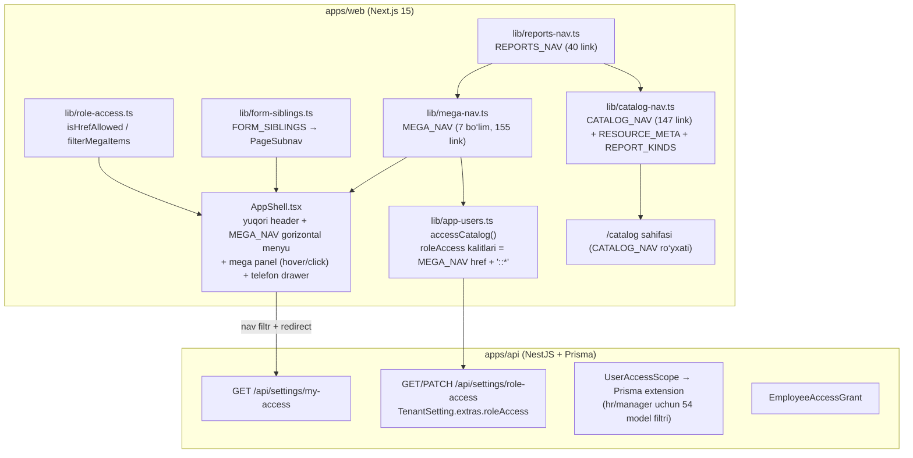

# HR HUB — axborot arxitekturasi (IA) auditi

Sana: 2026-10-01 · Branch: `feature/sidebar-reports-access` · Asos: `main` @ `a37ce19`

Bu hujjat faqat audit: kod, route, DB schema o‘zgartirilmagan. Raqamlar repo ichidagi fayllardan
skript bilan sanalgan (route’lar `apps/web/src/app/**/page.tsx`, navigatsiya havolalari
`mega-nav.ts`, `catalog-nav.ts`, `reports-nav.ts`, `form-siblings.ts`, generic katalog resurslari
`apps/api/src/catalog/catalog.resources.ts`). Aniq bo‘lmagan joylar «tekshirish kerak» deb belgilangan.

Sidebar va bo‘lim nomlari rus tilida qoladi (foydalanuvchi qarori): Главная, Сотрудники,
Посещаемость, Зарплата, Отчёты, Доступы, Техобслуживание, Коммуникации, Настройки.

---

## 1. Hozirgi arxitektura va navigatsiya

### 1.1. Raqamlar

| Ko‘rsatkich | Qiymat |
|---|---|
| Web `page.tsx` jami | 316 (shundan `(app)` ichida 306, `/m` mobil-web 10) |
| `/catalog/**` sahifalari | 214 (detail/new/edit/import bilan) |
| `/catalog/reports/**` sahifalari | 41 (40 ta statik + `[kind]` generic) |
| `MEGA_NAV` havolalari | 155 (ichida takror yo‘q) |
| `CATALOG_NAV` havolalari | 147 (146 unikal; `/catalog/personnel-changes` 2 marta) |
| `REPORTS_NAV` havolalari | 40 (ikkalasiga ham qo‘shiladi) |
| `FORM_SIBLINGS` havolalari | 194 (sahifa ichidagi ikkinchi qator) |
| `MEGA_NAV` ∩ `CATALOG_NAV` | 116 href; hisobotlarsiz 76 |
| Generic `/catalog/[resource]` orqali ochiladigan nav havolalari | 8 |
| API generic katalog resurslari | 50 |
| Buzilgan (route topilmaydigan) nav havolasi | 0 |

### 1.2. Diagramma

### 1.3. AppShell (hozirgi holat)

- `AppShell.tsx` (~1500 qator): yuqorida brend, `MEGA_NAV` bo‘limlari gorizontal tugmalar,
  hover/click bilan ochiladigan mega panel; telefonda butun `MEGA_NAV` drawer’da.
- Header o‘ng tomoni: global qidiruv (`/api/me/search`, xodim/jismoniy shaxs/bo‘lim),
  «tezkor amallar» menyusi, bildirishnomalar (`/api/me/notifications`, 60 s polling), profil/tema.
- «Tezkor amallar» ichida boshqa modullarga olib boruvchi linklar bor:
  `/catalog/hr-documents?action=create`, `/employees?action=create`,
  `/attendance?tab=requests&scope=to_me`, `/m`. Reja bo‘yicha bular sahifa toolbar’ida qolishi kerak.
- Route gating: `my-access` natijasida ruxsat etilmagan sahifadan `/dashboard` ga redirect
  (`AppShell.tsx` ~193-qator). `/dashboard` va `/` har doim ochiq.
- `PageSubnav` (`FORM_SIBLINGS`) — sahifa sarlavhasi ostidagi ikkinchi qator. Ko‘p guruhlarda
  sibling’lar boshqa modulga olib boradi (masalan `employees` → `/employees/join-requests`).
- Boshqa sessiya bir vaqtning o‘zida `AppShell.tsx` ga `SeasonalBackdrop` va `shell.module.css`
  ranglarini o‘zgartirmoqda (dizayn ishi). Shell fazasi shu o‘zgarishlar bilan to‘qnashmasligi kerak.

### 1.4. Hech qaysi menyudan ochilmaydigan asosiy sahifalar

`/attendance` (Посещаемость asosiy ekrani, tablar: marks/days/requests…), `/payroll`
(davrlar, avanslar, qatorlar), `/reports` (6 tabli hisobot ekrani). Ularga faqat to‘g‘ridan URL,
dashboard yoki quick-action orqali kiriladi. Yangi sidebar’da ular bo‘lim landing’lari bo‘lishi kerak.

Shuningdek nav’da yo‘q, lekin ishlaydigan sahifalar: `/settings/users/roles/access`,
`/settings/users/roles/products`, `/catalog/grade-history/recommendations`,
`/catalog/settlements/history`, `/payroll/*/history`, integratsiya ichki sahifalari
(`/settings/artix|iiko|billz/*`), barcha `/new` va `/import` sahifalari (toolbar’dan ochiladi).

---

## 2. Route inventari va primary owner

Quyidagi jadval har bir kanonik (detail/new/import bo‘lmagan) route uchun: target sidebar
bo‘limi, hozirgi menyu manbasi, query variantlari, sahifa chaqiradigan asosiy API (lookups
chiqarib tashlangan) va sahifada topilgan amallar (create/edit/delete/export — manba kodidan
avtomatik aniqlangan, «tekshirish kerak» darajasida).

Nav manbasi: `mega` = `MEGA_NAV`, `catalog` = `CATALOG_NAV` (/catalog sahifasi),
`siblings` = `FORM_SIBLINGS` (PageSubnav). `mega+catalog` — foydalanuvchi bir sahifani ikki
xil asosiy menyuda ko‘radi (76 ta hisobot bo‘lmagan holat).

Owner bo‘yicha taqsimot (168 qator): Сотрудники 32, Посещаемость 22, Зарплата 16, Отчёты 41,
Доступы 5, Техобслуживание 8, Коммуникации 4, Настройки 37, Главная 2, Платформа 1.

| Route | Primary owner | Nav manbasi | Query variantlar | API | Amallar |
|---|---|---|---|---|---|
| `/` | Главная | — |  | /api/auth/login |  |
| `/attendance` | Посещаемость | — |  | /api/attendance/marks, /api/attendance/days, /api/attendance/devices | create,edit,delete,export |
| `/attendance/correction` | Посещаемость | catalog+siblings |  | /api/organization/divisions, /api/attendance/locations, /api/attendance/correction-matrix | edit |
| `/attendance/gps-tracking` | Посещаемость | siblings |  | /api/tracking/live, /api/tracking/employees, /api/attendance/gps-tracking |  |
| `/attendance/latest` | Посещаемость | siblings |  | /api/attendance/marks/latest |  |
| `/attendance/location-tracking` | Посещаемость | siblings |  | /api/organization/divisions, /api/attendance/location-tracking |  |
| `/attendance/marks` | Посещаемость | mega+catalog+siblings |  | /api/attendance/marks, /api/organization/divisions, /api/attendance/locations | create,edit,delete,export |
| `/attendance/problems` | Посещаемость | siblings |  | /api/attendance/problems | edit,export |
| `/catalog` | Настройки | catalog |  | — |  |
| `/catalog/absence-requests` | Посещаемость | mega+catalog+siblings |  | /api/hr/absences, /api/hr/absences/bulk-action, /api/hr/absence-types | create,edit,delete,export |
| `/catalog/absence-types` | Настройки | mega+catalog+siblings |  | /api/hr/absence-types, /api/catalog/time-types | create,edit,delete,export |
| `/catalog/absences` | Сотрудники | mega+catalog |  | /api/hr/absences, /api/hr/absence-types | create,edit,delete,export |
| `/catalog/access-grants` *(generic)* | Доступы | catalog |  | /api/catalog/access-grants | create,edit,delete,export |
| `/catalog/account-pairs` | Настройки | mega+siblings |  | /api/payroll/account-pairs, /api/settings/dictionaries, /api/payroll/account-pairs/bulk-status | create,edit,delete,export |
| `/catalog/accrual-types` | Настройки | mega+siblings |  | /api/catalog/accrual-types | create,edit,delete,export |
| `/catalog/avg-salaries` | Настройки | mega+catalog |  | /api/settings/dictionaries, /api/settings/audit | create,edit,delete,export |
| `/catalog/bonus-accruals` | Зарплата | mega+catalog |  | /api/payroll/bonus-accruals, /api/payroll/bonus-accruals/bulk-, /api/organization/divisions | create,edit,delete,export |
| `/catalog/candidates` *(generic)* | Сотрудники | catalog+siblings |  | /api/catalog/candidates | create,edit,delete,export |
| `/catalog/career-paths` | Сотрудники | catalog+siblings |  | /api/catalog/career-paths | create,edit,delete,export |
| `/catalog/career-steps` *(generic)* | Сотрудники | catalog |  | /api/catalog/career-steps | create,edit,delete,export |
| `/catalog/cashboxes` | Настройки | mega+catalog |  | /api/settings/dictionaries, /api/settings/org, /api/settings/audit | create,edit,delete,export |
| `/catalog/clearance-sheets` | Сотрудники | mega+catalog+siblings |  | /api/catalog/clearance-sheets, /api/catalog/clearance-items, /api/catalog/clearance-sheets/export | create,edit,delete,export |
| `/catalog/clearance-templates` | Сотрудники | catalog+siblings |  | /api/catalog/clearance-templates | create,edit,delete,export |
| `/catalog/coa` | Настройки | mega+catalog+siblings |  | /api/settings/dictionaries, /api/settings/account-settings | create,edit,delete,export |
| `/catalog/coa-main` | Настройки | siblings |  | /api/settings/dictionaries, /api/settings/account-settings | create,edit,delete,export |
| `/catalog/currencies` | Настройки | mega+catalog |  | /api/settings/dictionaries, /api/settings/org, /api/settings/audit | create,edit,delete,export |
| `/catalog/deduction-types` | Настройки | mega+siblings |  | /api/catalog/deduction-types | create,edit,delete,export |
| `/catalog/device-control` | Техобслуживание | mega+siblings |  | /api/attendance/devices | export |
| `/catalog/devices` | Техобслуживание | mega+catalog+siblings | /catalog/devices?filter=new | /api/attendance/devices, /api/attendance/devices/bulk-delete, /api/attendance/locations | create,edit,delete,export |
| `/catalog/devices/link` | Техобслуживание | siblings |  | /api/attendance/office-link/sessions, /api/attendance/office-link/download-bound, /api/attendance/office-link/download-android | create,delete |
| `/catalog/dismissal-analytics` | Сотрудники | mega+catalog+siblings |  | /api/catalog/analytics/dismissal-dashboard |  |
| `/catalog/dismissal-reasons` | Настройки | mega+catalog+siblings |  | /api/catalog/dismissal-reasons | create,edit,delete,export |
| `/catalog/division-groups` *(generic)* | Сотрудники | catalog |  | /api/catalog/division-groups | create,edit,delete,export |
| `/catalog/division-stats` | Сотрудники | mega+catalog+siblings |  | /api/catalog/analytics/division-stats |  |
| `/catalog/document-types` | Настройки | mega |  | /api/settings/dictionaries | create,edit,delete,export |
| `/catalog/dynamic-facts` | Настройки | mega+siblings |  | /api/catalog/dynamic-objects, /api/catalog/dynamic-fields | create,edit,delete,export |
| `/catalog/dynamic-fields` | Настройки | mega+siblings |  | /api/catalog/dynamic-fields, /api/settings/dictionaries, /api/catalog/dynamic-objects | create,edit,delete,export |
| `/catalog/dynamic-objects` | Настройки | mega+siblings |  | /api/catalog/dynamic-objects, /api/catalog/dynamic-fields | create,edit,delete,export |
| `/catalog/education-types` | Настройки | mega |  | /api/settings/dictionaries | create,edit,delete,export |
| `/catalog/employment-sources` | Настройки | mega+catalog+siblings |  | /api/settings/dictionaries | create,edit,delete,export |
| `/catalog/fact-types` | Настройки | mega+siblings |  | /api/catalog/fact-types | create,edit,delete,export |
| `/catalog/facts` | Настройки | mega+siblings |  | /api/catalog/facts, /api/catalog/fact-types, /api/catalog/divisions | create,edit,delete,export |
| `/catalog/gph-contracts` | Сотрудники | catalog+siblings |  | /api/catalog/gph-contracts, /api/catalog/gph-contracts/export | create,edit,delete,export |
| `/catalog/gph-services` | Зарплата | mega+catalog+siblings |  | /api/catalog/gph-services, /api/catalog/gph-contracts, /api/organization/divisions | create,edit,delete,export |
| `/catalog/grade-history` | Сотрудники | mega+catalog+siblings |  | /api/catalog/grade-history, /api/catalog/grade-history/recommendations, /api/catalog/grade-history/fill | create,edit,delete,export |
| `/catalog/grades` | Сотрудники | mega+catalog |  | /api/catalog/grades | create,edit,delete,export |
| `/catalog/hire-document-exceptions` | Настройки | mega |  | /api/hire-document-exceptions, /api/organization/divisions, /api/settings/dictionaries | create,edit,delete,export |
| `/catalog/hr-documents` | Сотрудники | mega+catalog+siblings |  | /api/hr/documents, /api/hr/documents/export | create,edit,export |
| `/catalog/hr-requests` | Сотрудники | mega+catalog |  | /api/hr/change-requests, /api/hr/change-requests/export | create,edit,delete,export |
| `/catalog/incident-types` | Сотрудники | catalog+siblings |  | /api/catalog/incident-types | create,edit,delete,export |
| `/catalog/incidents` | Сотрудники | mega+catalog |  | /api/catalog/incidents, /api/catalog/incidents/export | create,delete,export |
| `/catalog/indicators` | Настройки | mega+catalog+siblings |  | /api/settings/dictionaries, /api/settings/audit | create,edit,delete,export |
| `/catalog/institutions` | Настройки | mega |  | /api/settings/dictionaries | create,edit,delete,export |
| `/catalog/internal-trips` | Посещаемость | mega+catalog |  | /api/hr/internal-trips, /api/hr/internal-trips/bulk-action, /api/organization/divisions | create,export |
| `/catalog/loans` | Зарплата | mega+catalog+siblings |  | /api/payroll/loans, /api/payroll/loans/bulk- | create,edit,delete,export |
| `/catalog/location-requests` | Посещаемость | mega+catalog |  | /api/hr/requests, /api/hr/requests/bulk-action, /api/attendance/locations | create,edit,delete,export |
| `/catalog/location-types` *(generic)* | Посещаемость | siblings |  | /api/catalog/location-types | create,edit,delete,export |
| `/catalog/locations` | Посещаемость | mega+catalog+siblings |  | /api/attendance/locations, /api/catalog/location-types | create,edit,delete,export |
| `/catalog/name-changes` | Сотрудники | catalog+siblings |  | /api/catalog/name-changes, /api/catalog/name-changes/export | create,edit,delete,export |
| `/catalog/nationality` | Настройки | mega+catalog |  | /api/settings/dictionaries | create,edit,delete,export |
| `/catalog/one-time-accruals` | Зарплата | mega+catalog |  | /api/payroll/one-time-accruals, /api/payroll/one-time-accruals/bulk-, /api/organization/divisions | create,edit,delete,export |
| `/catalog/overtime-requests` | Посещаемость | mega+catalog |  | /api/hr/requests, /api/hr/requests/bulk-action | create,edit,delete,export |
| `/catalog/payment-orders` | Зарплата | mega+catalog+siblings |  | /api/payroll/payment-orders, /api/payroll/payment-orders/bulk-, /api/catalog/accrual-types | create,edit,delete,export |
| `/catalog/personnel-changes` | Сотрудники | mega+catalog+siblings | /catalog/personnel-changes?groupBy=position | /api/catalog/analytics/personnel-changes |  |
| `/catalog/persons` | Сотрудники | mega+catalog+siblings |  | /api/persons, /api/settings/dictionaries, /api/persons/bulk/status | create,edit,delete,export |
| `/catalog/position-groups` *(generic)* | Сотрудники | catalog+siblings |  | /api/catalog/position-groups | create,edit,delete,export |
| `/catalog/position-schedules` | Посещаемость | mega+catalog+siblings |  | /api/catalog/position-schedules | create,edit,delete,export |
| `/catalog/position-templates` | Настройки | mega |  | /api/catalog/position-templates, /api/catalog/tariff-groups | create,edit,delete,export |
| `/catalog/production-calendars` | Посещаемость | siblings |  | /api/attendance/production-calendars | create,edit,delete,export |
| `/catalog/relatives` *(generic)* | Сотрудники | catalog |  | /api/catalog/relatives | create,edit,delete,export |
| `/catalog/report-templates` | Настройки | mega |  | /api/catalog/report-templates | create,edit,delete,export |
| `/catalog/reports/access` | Отчёты | mega+catalog |  | /api/catalog/analytics/access | export |
| `/catalog/reports/account-balance` | Отчёты | mega |  | /api/settings/dictionaries, /api/settings/account-balance-report, /api/catalog/analytics/account-balance | edit,export |
| `/catalog/reports/attendance-overview` | Отчёты | mega+catalog |  | /api/attendance/locations, /api/catalog/analytics/attendance-overview | create,export |
| `/catalog/reports/attendance-t13` | Отчёты | mega+catalog |  | /api/attendance/locations, /api/catalog/analytics/attendance-overview | create,export |
| `/catalog/reports/candidates` | Отчёты | mega+catalog |  | /api/catalog/analytics/candidates | export |
| `/catalog/reports/discipline` | Отчёты | mega+catalog |  | /api/catalog/analytics/discipline, /api/catalog/analytics/discipline/employee | export |
| `/catalog/reports/dismissals-by-division` | Отчёты | mega+catalog |  | /api/catalog/analytics/dismissals-by-division | export |
| `/catalog/reports/dismissals-by-reason` | Отчёты | mega+catalog |  | /api/catalog/analytics/dismissals-by-reason | export |
| `/catalog/reports/distance` | Отчёты | mega+catalog |  | /api/catalog/analytics/distance | export |
| `/catalog/reports/division-expenses` | Отчёты | mega+catalog |  | /api/catalog/analytics/division-expenses | export |
| `/catalog/reports/division-mode` | Отчёты | mega+catalog | /catalog/reports/division-mode?period=1 | /api/catalog/analytics/division-mode | export |
| `/catalog/reports/employees` | Отчёты | mega+catalog |  | /api/catalog/analytics/employees | export |
| `/catalog/reports/fot` | Отчёты | mega+catalog |  | /api/catalog/analytics/fot | create,export |
| `/catalog/reports/gender` | Отчёты | mega+catalog |  | /api/settings/dictionaries, /api/catalog/analytics/gender, /api/catalog/analytics/gender/export | create,delete,export |
| `/catalog/reports/grade-changes` | Отчёты | mega+catalog |  | /api/catalog/analytics/grade-changes | export |
| `/catalog/reports/grades` | Отчёты | mega+catalog |  | /api/catalog/analytics/grades | export |
| `/catalog/reports/hourly` | Отчёты | mega+catalog |  | /api/catalog/analytics/hourly | export |
| `/catalog/reports/lateness` | Отчёты | mega+catalog |  | /api/catalog/analytics/lateness | create,export |
| `/catalog/reports/marks-detail` | Отчёты | mega+catalog |  | /api/attendance/locations, /api/catalog/analytics/marks-detail | export |
| `/catalog/reports/movement-divisions` | Отчёты | mega+catalog |  | /api/catalog/analytics/movement-divisions | export |
| `/catalog/reports/movement-staff` | Отчёты | mega+catalog |  | /api/catalog/analytics/movement-staff | export |
| `/catalog/reports/multi-shift` | Отчёты | mega+catalog |  | /api/catalog/analytics/multi-shift | export |
| `/catalog/reports/occupancy` | Отчёты | mega+catalog |  | /api/catalog/analytics/occupancy | export |
| `/catalog/reports/one-time` | Отчёты | mega+catalog |  | /api/catalog/positions, /api/catalog/analytics/one-time | export |
| `/catalog/reports/payments` | Отчёты | mega+catalog |  | /api/catalog/analytics/payments | export |
| `/catalog/reports/payroll-book` | Отчёты | mega+catalog |  | /api/catalog/analytics/payroll-book | export |
| `/catalog/reports/payroll-grouped` | Отчёты | mega+catalog |  | /api/catalog/analytics/payroll-grouped | create,delete,export |
| `/catalog/reports/penalties` | Отчёты | mega+catalog |  | /api/catalog/positions, /api/catalog/analytics/penalties | export |
| `/catalog/reports/positions` | Отчёты | mega+catalog |  | /api/catalog/analytics/positions | export |
| `/catalog/reports/preliminary-salary` | Отчёты | mega+catalog |  | /api/catalog/positions, /api/catalog/analytics/preliminary-salary | export |
| `/catalog/reports/relatives` | Отчёты | mega+catalog |  | /api/settings/dictionaries, /api/catalog/analytics/relatives | export |
| `/catalog/reports/schedule-plan` | Отчёты | mega+catalog |  | /api/catalog/analytics/schedule-plan | export |
| `/catalog/reports/schedules` | Отчёты | mega+catalog |  | /api/catalog/analytics/schedules | export |
| `/catalog/reports/shifts` | Отчёты | mega+catalog | /catalog/reports/shifts?variant=2 | /api/catalog/analytics/shifts | export |
| `/catalog/reports/staffing` | Отчёты | mega+catalog |  | /api/catalog/analytics/staffing, /api/catalog/analytics/staffing/export | export |
| `/catalog/reports/tenure` | Отчёты | mega+catalog |  | /api/catalog/accrual-types, /api/catalog/analytics/tenure | create,delete,export |
| `/catalog/reports/time-types` | Отчёты | mega+catalog |  | /api/catalog/schedule-shifts, /api/catalog/analytics/time-types | export |
| `/catalog/reports/timesheet-adjustments` | Отчёты | mega+catalog |  | /api/catalog/analytics/timesheet-adjustments | export |
| `/catalog/reports/trial-balance` | Отчёты | mega |  | /api/settings/dictionaries, /api/catalog/analytics/trial-balance, /api/catalog/analytics/trial-balance/export | edit,export |
| `/catalog/reports/vacancies` | Отчёты | mega+catalog |  | /api/catalog/analytics/vacancies | export |
| `/catalog/roster-change-requests` | Посещаемость | mega+catalog+siblings |  | /api/hr/requests, /api/hr/requests/bulk-action, /api/catalog/schedule-shifts | create,edit,delete,export |
| `/catalog/rosters` | Посещаемость | mega+catalog+siblings |  | /api/catalog/rosters | create,edit,delete,export |
| `/catalog/sales-accruals` | Зарплата | mega+catalog+siblings |  | /api/payroll/sales-accruals, /api/payroll/sales-accruals/bulk-, /api/settings/dictionaries | create,edit,delete,export |
| `/catalog/sales-policies` | Зарплата | siblings |  | /api/payroll/sales-accruals/rates | edit |
| `/catalog/schedule-change-requests` | Посещаемость | mega+catalog+siblings |  | /api/hr/requests, /api/hr/requests/bulk-action | create,edit,delete,export |
| `/catalog/schedule-overrides` | Посещаемость | mega+catalog+siblings |  | /api/catalog/schedule-overrides | create,edit,delete,export |
| `/catalog/schedule-shifts` | Посещаемость | mega+catalog+siblings |  | /api/catalog/shift-assignments, /api/catalog/shift-assignments/rebuild, /api/catalog/shift-assignments/bulk-action | delete,export |
| `/catalog/settlements` | Зарплата | mega+catalog+siblings |  | /api/payroll/settlements, /api/payroll/settlements/bulk-, /api/payroll/account-pairs | create,edit,delete,export |
| `/catalog/specialties` | Настройки | mega |  | /api/settings/dictionaries | create,edit,delete,export |
| `/catalog/staff-positions` | Сотрудники | mega+catalog+siblings |  | /api/catalog/staff-positions, /api/catalog/staff-positions/bulk-close, /api/catalog/staff-positions/bulk-delete | create,edit,delete,export |
| `/catalog/staff-positions/structure` | Сотрудники | catalog+siblings |  | /api/catalog/staff-positions/tree, /api/catalog/analytics/positions-structure/export | edit,export |
| `/catalog/tariff-approvals` | Сотрудники | catalog+siblings |  | /api/catalog/tariff-approvals, /api/catalog/tariff-approvals/bulk-post, /api/catalog/tariff-approvals/bulk-delete | create,edit,delete,export |
| `/catalog/tariff-groups` | Сотрудники | mega+catalog+siblings |  | /api/catalog/tariff-groups, /api/catalog/grades | create,edit,delete,export |
| `/catalog/time-types` | Настройки | mega+siblings |  | /api/catalog/time-types | create,edit,delete,export |
| `/catalog/timesheet-adjustments` | Посещаемость | mega+catalog+siblings |  | /api/catalog/timesheet-adjustments, /api/catalog/timesheet-adjustments/export | create,edit,delete,export |
| `/catalog/transfers` | Сотрудники | catalog+siblings |  | /api/hr/documents, /api/hr/documents/export | create,edit,export |
| `/catalog/travel-expenses` | Зарплата | mega+catalog+siblings |  | /api/payroll/travel-expenses, /api/payroll/travel-expenses/bulk-, /api/catalog/accrual-types | create,edit,delete,export |
| `/catalog/vacancies` *(generic)* | Сотрудники | catalog+siblings |  | /api/catalog/vacancies | create,edit,delete,export |
| `/catalog/wage-changes` | Сотрудники | catalog+siblings |  | /api/catalog/wage-changes, /api/catalog/wage-changes/export | create,edit,delete,export |
| `/catalog/work-schedules` | Посещаемость | mega+catalog+siblings |  | /api/attendance/schedules | create,edit,delete,export |
| `/catalog/year-summary` | Сотрудники | mega+catalog+siblings |  | /api/catalog/analytics/year-summary-dashboard | export |
| `/dashboard` | Главная | mega+catalog |  | /api/dashboard/stats, /api/organization/divisions, /api/attendance/schedules | create,export |
| `/divisions` | Сотрудники | mega+catalog+siblings | /divisions?tab=divisions, /divisions?tab=tree, /divisions?tab=groups | /api/organization/divisions, /api/catalog/division-groups, /api/organization/divisions/export | create,edit,delete,export |
| `/employees` | Сотрудники | mega+catalog+siblings | /employees?tab=dismissed, /employees?tab=gph | /api/employees/match-former, /api/persons, /api/organization/divisions | create,edit,export |
| `/employees/join-requests` | Коммуникации | siblings |  | /api/telegram/status, /api/telegram/join-requests, /api/telegram/invites |  |
| `/news` | Коммуникации | mega+siblings |  | /api/news, /api/news/birthdays | edit,delete |
| `/payroll` | Зарплата | — |  | /api/payroll/periods, /api/payroll/advances, /api/payroll/lines | create,edit,export |
| `/payroll/accruals` | Зарплата | mega+catalog |  | /api/catalog/payment-orders, /api/payroll/accruals, /api/payroll/accruals/bulk- | create,edit,delete,export |
| `/payroll/allowance-policies` | Зарплата | mega+catalog |  | /api/payroll/allowance-policies, /api/payroll/allowance-policies/bulk-delete | create,edit,delete,export |
| `/payroll/fine-policies` | Зарплата | mega+catalog |  | /api/payroll/fine-policies, /api/payroll/fine-policies/bulk-delete | create,edit,delete,export |
| `/payroll/manual` | Зарплата | mega+catalog |  | /api/payroll/manual-ops, /api/payroll/manual-ops/bulk- | create,edit,delete,export |
| `/payroll/timesheets` | Зарплата | mega+catalog |  | /api/catalog/timesheet-adjustments, /api/payroll/timesheets, /api/payroll/timesheets/bulk-post | create,edit,delete,export |
| `/payroll/vedomost` | Зарплата | mega+catalog |  | /api/payroll/sheets, /api/payroll/sheets/bulk-, /api/organization/divisions | create,edit,delete,export |
| `/positions` | Сотрудники | mega+catalog+siblings | /positions?tab=positions, /positions?tab=groups | /api/catalog/position-groups | create,edit,delete,export |
| `/reports` | Отчёты | — |  | /api/reports/overview, /api/reports/attendance/t13, /api/reports/attendance/lateness | export |
| `/settings` | Настройки | mega+catalog+siblings | /settings?tab=main, /settings?tab=org, /settings?tab=dictionaries&dict=labor_functions, /settings?tab=dictionaries&dict=science, /settings?tab=dictionaries&dict=languages, /settings?tab=dictionaries&dict=lang_levels, /settings?tab=dictionaries&dict=certificates, /settings?tab=dictionaries&dict=kinship, /settings?tab=dictionaries&dict=marital, /settings?tab=dictionaries&dict=tenure, /settings?tab=dictionaries&dict=awards, /settings?tab=dictionaries&dict=inventory_types, /settings?tab=dictionaries&dict=inventory, /settings?tab=dictionaries&dict=cars, /settings?tab=extra&dict=trip_reasons, /settings?tab=extra&dict=sick_reasons, /settings?tab=integrations&sys=onec, /settings?tab=integrations&sys=esign, /settings?tab=integrations&sys=mehnat, /settings?tab=dictionaries, /settings?tab=extra, /settings?tab=admin, /settings?tab=integrations, /settings?tab=audit | /api/settings/org, /api/settings/users, /api/settings/dictionaries | create,edit,delete,export |
| `/settings/account-settings` | Настройки | mega+catalog+siblings |  | /api/settings/account-settings, /api/settings/dictionaries | edit |
| `/settings/artix` | Техобслуживание | mega+catalog+siblings |  | /api/settings/integrations | create,edit,delete,export |
| `/settings/audit` | Настройки | mega+catalog+siblings |  | /api/settings/audit |  |
| `/settings/banks` | Настройки | mega+catalog+siblings |  | /api/settings/dictionaries | create,edit,delete,export |
| `/settings/billz` | Техобслуживание | mega+catalog+siblings |  | /api/settings/integrations | create,edit,delete,export |
| `/settings/billz-sales` | Техобслуживание | mega+catalog+siblings |  | /api/settings/integrations | edit,delete,export |
| `/settings/countries` | Настройки | mega+catalog+siblings |  | /api/settings/dictionaries, /api/settings/org, /api/settings/audit | create,edit,delete,export |
| `/settings/google-form` | Коммуникации | mega+catalog+siblings |  | /api/employee-form/schema |  |
| `/settings/iiko` | Техобслуживание | mega+catalog+siblings |  | /api/settings/integrations | edit,export |
| `/settings/iiko-sales` | Техобслуживание | mega+catalog+siblings |  | /api/settings/integrations | edit,delete,export |
| `/settings/mobile-access` | Доступы | mega+siblings |  | /api/mobile-accounts | create,edit,delete |
| `/settings/organizations` | Настройки | mega+catalog+siblings |  | /api/settings/dictionaries | create,edit,delete,export |
| `/settings/payroll-calc` | Настройки | mega+catalog+siblings |  | /api/settings/payroll-calc, /api/catalog/account-pairs | edit |
| `/settings/person-docs` | Настройки | mega+catalog+siblings |  | /api/settings/person-docs-import, /api/settings/import-person-docs | edit,export |
| `/settings/photos` | Настройки | mega+catalog+siblings |  | /api/storage/photos/import | export |
| `/settings/quickstart` | Настройки | mega+catalog+siblings |  | /api/settings/quickstart | edit |
| `/settings/telegram` | Коммуникации | mega+catalog+siblings |  | /api/settings/integrations, /api/telegram/status, /api/telegram/setup-webhook | edit |
| `/settings/users` | Доступы | mega+catalog+siblings |  | /api/settings/users, /api/settings/dictionaries, /api/settings/org | create,edit,delete,export |
| `/settings/users/roles` | Доступы | catalog+siblings |  | /api/settings/dictionaries, /api/settings/users, /api/settings/role-access | create,edit,delete,export |
| `/settings/users/roles/access` | Доступы | — |  | /api/settings/dictionaries, /api/settings/users, /api/settings/role-access | create,edit,delete,export |
| `/tenants` | Платформа | mega+catalog |  | /api/tenants |  |

Detail/create/import sahifalari (77 ta, masalan `/employees/[id]`, `/catalog/*/new`,
`/payroll/vedomost/history`) o‘z ota route’ining owner’iga tegishli va sidebar’da alohida
ko‘rsatilmaydi.

---

## 3. Dublikat deb gumon qilingan sahifalar (dalil bilan)

| Juftlik | Taqqoslash | Xulosa |
|---|---|---|
| `/catalog/personnel-changes` ikki marta `CATALOG_NAV`da | Bir xil href, bir xil label | **Haqiqiy dublikat** (faqat nav yozuvi). Registry’da bitta yozuv. |
| `/catalog/personnel-changes` va `?groupBy=position` | API bir xil (`analytics/personnel-changes`), `groupBy=division|position` — boshqa guruhlash | Dublikat emas: bitta sahifaning 2 ko‘rinishi. Registry’da bitta item, variant `alias` sifatida saqlanadi (roleAccess kaliti `…?groupBy=position::*` bor). |
| `/catalog/reports/shifts` va `?variant=2` | Bir sahifa, `variant=2` boshqa ustunlar to‘plami | Dublikat emas. Hisobotlar registry’da 2 ta alohida yozuv (alohida bookmark va roleAccess kaliti). |
| `/catalog/reports/division-mode` va `?period=1` | Bir API, `period=1` — davr rejimi | Dublikat emas. 2 ta hisobot yozuvi. |
| `/catalog/reports/attendance-overview` va `attendance-t13` | Ikkalasi `AttendanceOverviewReport`, T-13 `variant="t13"` | Dublikat emas (T-13 forma). 2 ta yozuv. |
| `/reports?tab=t13|lateness|marks|fot|hr` va `/catalog/reports/attendance-t13|lateness|marks-detail|fot|movement-*` | Turli API: `/api/reports/*` (oddiy, davr bo‘yicha) va `/api/catalog/analytics/*` (ko‘p filtrli, eksport) | Ma’nosi o‘xshash, lekin API, filter va eksport farq qiladi → **dalilsiz birlashtirilmaydi**. `/reports` hub bo‘ladi, eski tablar «Быстрые отчёты» sifatida saqlanadi. |
| `/catalog/absences` (Кадры) va `/catalog/absence-requests` (Посещения) | Ikkalasi `/api/hr/absences`; birinchisi barcha qayd etilgan yo‘qliklar, ikkinchisi so‘rov/tasdiqlash oqimi | Bir API, turli filtr/maqsad. Dublikat emas — tekshirish kerak (status filtri). Owner: Сотрудники / Посещаемость. |
| `/catalog/hr-documents` va `/catalog/transfers` | Ikkalasi `/api/hr/documents`; transfers turi bo‘yicha filtr | Dublikat emas (filtrlangan ko‘rinish). |
| `/divisions?tab=…`, `/positions?tab=…` | Bitta sahifaning tablari | Registry’da bitta item + query alias’lar. |
| `/settings?tab=dictionaries&dict=*` (14 ta) | Bitta sahifa, `dict` parametri bo‘yicha turli ma’lumotnoma | Dublikat emas. Настройки → Справочники guruhida qoladi. |
| `MEGA_NAV` ↔ `CATALOG_NAV` 76 umumiy href | Bir xil sahifa ikki menyuda | Funktsional xato emas; yangi registry’da har href bitta primary bo‘limga. `/catalog` sahifasi «hammasi» katalogi sifatida Настройки ichida qoladi. |

---

## 4. Broken href, generic route va mavjud bo‘lmagan feature’lar

- **Broken nav havolalari: 0.** Barcha 155 + 147 + 194 href route yoki generic resursga resolve bo‘ladi.
- **Generic `/catalog/[resource]` orqali ishlaydiganlar (8):** `division-groups`, `position-groups`,
  `career-steps`, `relatives`, `candidates`, `vacancies`, `access-grants`, `location-types`.
  Bular umumiy CRUD jadvali (`RESOURCE_META` maydonlari), maxsus workflow yo‘q.
- **`/catalog/reports/[kind]`** — `REPORT_KINDS` bo‘yicha universal jadval; statik sahifasi bo‘lmagan
  turlar uchun ishlaydi (`division-stats`, `year-summary`, `dismissal-dashboard` va boshq.).
  Bo‘sh holatda xom JSON ko‘rsatadi — standartlashtirishda tuzatish kerak.
- **Mavjud bo‘lmagan (UI’da ko‘rsatilmasligi kerak):** qurilma health/sync log dashboard’i,
  integratsiya holati monitoringi (faqat sozlama va xato ro‘yxatlari bor: `/settings/artix/errors`,
  `/settings/iiko/errors`), support ticket, markaziy ruxsat audit ekrani.

---

## 5. Ruxsat tushunchalari — farqlar

| Tushuncha | Saqlanadigan joy | Kimga tegishli | Nimani boshqaradi | Mavjud endpoint/UI | Kamchilik |
|---|---|---|---|---|---|
| **roleAccess** | `TenantSetting.extras.roleAccess` (`{roleId: {"/href::*": true}}`) | Ilova foydalanuvchisining katalog roli | Web sahifa/nav ko‘rinishi | `GET/PATCH /api/settings/role-access`, `GET /api/settings/my-access`; UI `/settings/users/roles/access` | **Faqat frontend gating**: API endpointlar roleAccess’ni tekshirmaydi (`@Roles` auth roli bo‘yicha). Kalitlar `MEGA_NAV` href’laridan yasaladi (`accessCatalog()`), shuning uchun href o‘zgarsa grant uziladi. |
| **UserAccessScope** | `user_access_scopes` (`kind`: location/employee, `resourceId`) | Ilova foydalanuvchisi (hr/manager) | Qaysi filial/xodim ma’lumotini ko‘ra oladi | `/settings/users` formasi, `GET /api/settings/users/scope-options`; Prisma extension (54 model) | Yaxshi himoyalangan; xodim ruxsati bilan aralashmasligi kerak. |
| **system_access_closed** | `EmployeeAccessGrant` (`accessType=profile_flag`, `resource=system_access_closed`) | Xodim | Xodim akkaunti login’ini bloklaydi (`auth.service.ts` ~172) | `PATCH /api/employees/:id/flags`, `POST /api/employees/bulk-flags`; UI `/employees` (bulk) va `/employees/[id]` | Audit yozilmaydi; sabab saqlanmaydi. |
| **Boshqa profile flag’lar** | `profile_flag`: `exclude_from_stats`, `marks_blocked` | Xodim | Statistika va belgi qo‘yishni bloklash | O‘sha flags endpointlari | Audit yo‘q. |
| **location grant** | `accessType=location`, `resource=locationId`, `note=auto|manual|visit` | Xodim | Xodim biriktirilgan filial(lar); data-scope va Face ID sync shundan foydalanadi | `PATCH /api/employees/:id/locations`; attendance servis ichida | `expiresAt` hisobga olinadi (attendance/face), audit yo‘q. |
| **reports_to** | `accessType=reports_to`, `resource=rahbar employeeId` | Xodim | Xodim kartasida «bo‘ysunuvchilar» ro‘yxati | Faqat o‘qiladi (`employees.service.ts` ~584) | Yozuvchi UI/endpoint yo‘q (faqat seed/generic katalog). |
| **org_full / org_custom / org_subordinate / kpe_full** | `EmployeeAccessGrant` | Xodim | Faqat «Отчет по доступам сотрудников» hisobotida ko‘rsatiladi | `GET /api/catalog/analytics/access` | Biror joyda kuch bilan qo‘llanmaydi (enforcement yo‘q); yozish faqat generic katalog yoki seed orqali. Hisobot `expiresAt`ni e’tiborsiz qoldiradi. |
| **Generic `access-grants` CRUD** | O‘sha jadval | — | Har qanday turdagi grant | `GET/POST/PATCH/DELETE /api/catalog/access-grants` | **Hard delete**, audit yo‘q, `employeeId` tenant’ga tegishliligini generic servis tekshiradimi — tekshirish kerak. `GET` `Role.employee` ga ham ochiq (butun tenant grant’lari) — xavf. |
| **Mobil akkaunt** | `User` (role employee, `meta.employeeId/login`) | Xodim | Mobil ilovaga login | `/api/mobile-accounts/*`, UI `/settings/mobile-access` | Ruxsat emas, akkaunt; Доступы bo‘limida «Мобильные аккаунты» sifatida ko‘rsatiladi. |
| **`/catalog/reports/access`** | — | — | Hisobot | `analytics/access` | Hisobot bo‘lib qoladi, `/access` bilan aralashmaydi. |

Audit uchun umumiy `AuditLog` modeli bor (`tenantId, userId, action, entity, entityId, meta Json`).
Grant/revoke auditini shu jadvalga `meta` ichida actor, target employee, before/after, sabab va
request source bilan yozish mumkin — **yangi migration shart emas**. `EmployeeAccessGrant` da
`grantedBy/revokedAt/reason` ustunlari yo‘q; bular audit yozuvidan olinadi, sabab `note`ga ham yoziladi.

**Mavjud bo‘lmagan qism (5-faza uchun):** filtrlangan/sahifalangan grant ro‘yxati, xodim bo‘yicha
summary, grant berish (expiry + sabab + validatsiya + audit), soft revoke (sabab + audit),
bulk grant/revoke (qisman xato hisobot bilan), «ko‘rish» va «berish» huquqlarining ajratilishi.

---

## 6. Hisobotlarni yagona hub’ga xaritalash

Barcha 41 report sahifasi saqlanadi; hub ularga registry orqali link beradi. Variantlar alohida yozuv.

| Kategoriya | Hisobotlar (`/catalog/reports/…`) |
|---|---|
| Кадры (18) | staffing, gender, movement-divisions, dismissals-by-division, dismissals-by-reason, positions, grade-changes, timesheet-adjustments, movement-staff, candidates, vacancies, schedule-plan, occupancy, employees, tenure, grades, relatives, access |
| Посещаемость (15) | attendance-overview, discipline, division-mode?period=1, division-mode, attendance-t13, marks-detail, distance, hourly, shifts, shifts?variant=2, multi-shift, time-types, lateness, schedules |
| Зарплата (8) | payroll-book, payroll-grouped, payments, division-expenses, fot, one-time, preliminary-salary, penalties |
| Финансы (2) | account-balance, trial-balance (hozir Настройки → Организация ichida) |
| Аналитика (dashboard’lar) | division-stats, year-summary, dismissal-analytics, personnel-changes (+`?groupBy=position`) — hozir Кадры → Дашборд; hub’da «Аналитика» guruhi |
| Быстрые отчёты | `/reports?tab=overview|t13|lateness|marks|hr|fot` (`/api/reports/*`) |
| Generic | `/catalog/reports/[kind]` — registry’dagi statik bo‘lmagan turlar uchun |

Eksport: deyarli barcha sahifalarda CSV + XLSX (`/api/catalog/analytics/:kind/export.xlsx`) + print;
`positions` faqat XLSX/print, `payroll-grouped`, `trial-balance`, `account-balance` print’siz.
Barcha analytics endpointlari `@Roles(platform_admin, tenant_admin, hr, manager)`.

---

## 7. Target sidebar ↔ hozirgi joylashuv

| Sidebar (ru) | Ichki guruhlar | Hozir qayerda |
|---|---|---|
| Главная | Дашборд | `MEGA_NAV.home` (dashboard + news + device-control aralash) |
| Сотрудники | Сотрудники; Кадровые документы и заявки; Организация (подразделения, должности, позиции, разряды, тарифы); Подбор (кандидаты, вакансии) | `MEGA_NAV.hr` + `CATALOG_NAV.Кадры` |
| Посещаемость | Отметки и проблемы; Графики и расписания; Запросы; Локации и GPS | `MEGA_NAV.attendance` + siblings (`/attendance/*`) |
| Зарплата | Расчёт (табель, начисления, ведомость, ручные операции); Документы (взаиморасчеты, займы, поручения, командировки, бонусы, ГПХ); Политики | `MEGA_NAV.payroll` |
| Отчёты | `/reports` hub | `MEGA_NAV.reports` (REPORTS_NAV) + `/reports` (menyusiz) |
| Доступы | Доступы сотрудников (`/access/employees`); Пользователи; Роли и права; Мобильные аккаунты; Журнал | yangi `/access`; `/settings/users*`, `/settings/mobile-access`, `/catalog/access-grants` |
| Техобслуживание | Устройства; Удалённое управление; Привязка устройств; Интеграции (ARTIX, IIKO, Billz) | `MEGA_NAV.home` (device-control), `MEGA_NAV.attendance` (devices), `MEGA_NAV.settings` → Внешние системы |
| Коммуникации | Новости; Заявки из Telegram; Telegram Bot; Google Form | `MEGA_NAV.home` (news), siblings, `MEGA_NAV.settings` → Внешние системы |
| Настройки | Система; Справочники; Доп. справочники; Расчёт и счета; Импорт; Каталог (все модули); Аудит; Tenants (platform_admin) | `MEGA_NAV.settings` |

---

## 8. Risklar, bog‘liqliklar, migration va test rejasi

**Risklar**

1. **roleAccess kalitlari** `MEGA_NAV` href’lariga bog‘langan. Registry’ga o‘tishda grant
   matritsasi (`accessCatalog()`) yangi registry’dan, lekin **aynan o‘sha href’lar** bilan
   generatsiya qilinishi kerak; aks holda sozlangan rollar huquqini yo‘qotadi.
   Yangi route’lar (`/access/*`) uchun kalit qo‘shiladi, eski kalitlar alias orqali qoladi.
2. **Server-side enforcement yo‘q** (roleAccess). Sidebar’ni yashirish xavfsizlik emas —
   yangi `/access` endpointlari `@Roles` + tenant + data-scope bilan himoyalanadi.
3. **Generic katalog `GET` employee roliga ochiq** (`access-grants`, `relatives`, `candidates`…).
   `access-grants` uchun 5-fazada cheklash; qolganlari alohida backlog (tekshirish kerak).
4. **Parallel dizayn sessiyasi** `AppShell.tsx`/`shell.module.css`ni o‘zgartirmoqda —
   shell fazasida faqat struktura, ranglar CSS o‘zgaruvchilaridan olinadi.
5. `findSectionByPath()` qo‘lda yozilgan prefiks ro‘yxati — registry’dan avtomatik aniqlanishi kerak.

**Bosqichlar**

| Faza | Ish | Tekshiruv |
|---|---|---|
| 2 | `lib/nav-registry.ts`: bo‘lim → guruh → item (id, label, href, icon, aliases, platformOnly); `accessCatalog()` registry + legacy kalitlar; `scripts/check-nav-registry.js` (route resolve, primary dublikat, unassigned) | script + tsc |
| 3 | AppShell: chap sidebar (collapse, auto-expand, active), telefon drawer + pastki 4 shortcut + «Ещё»; header soddalashtiriladi; quick-action cross-module linklar olib tashlanadi | tsc, build, brauzer 360/768/1440 |
| 4 | `lib/reports-registry.ts` (41 sahifa + variantlar, category, filters, export, permission key); `/reports` hub (qidiruv, kategoriya, so‘nggi) — eski tablar saqlanadi | script: barcha report route registry’da |
| 5 | API `access` moduli: list/summary/grant/revoke/bulk + audit; UI `/access` landing + `/access/employees`; employee kartasida deep-link | API unit test (tenant, expired, duplicate, revoke, bulk partial) |
| 6 | Техобслуживание / Коммуникации / Настройки guruhlari registry’da; `/catalog` Настройки ichida | check script |
| 7 | tsc, build:web, build:api, api test, smoke (lokal DB kerak bo‘lganlari shartini yozib) | natijalar STATUS.md da |

**Migration:** hozircha kerak emas (audit `AuditLog`, revoke `isActive=false`, expiry `expiresAt`).
